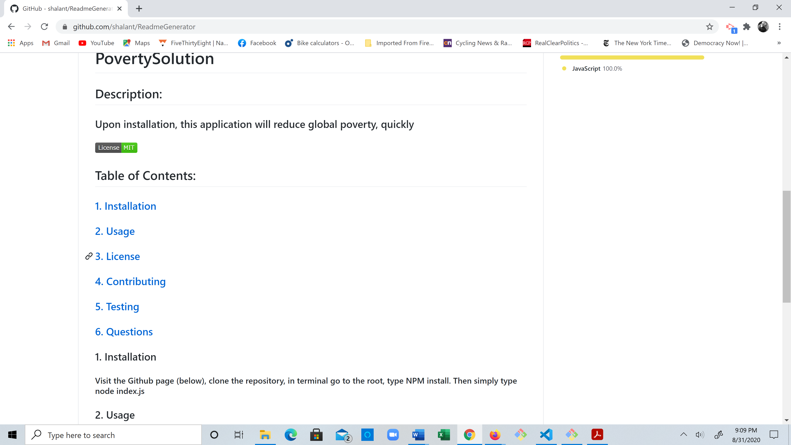

# PovertySolution
  
  ## Description:
  ### Upon installation, this application will reduce global poverty
  #### 

  ## Table of Contents:
  ###     [1. Installation](#Installation)
  ###     [2. Usage](#Usage)
  ###     [3. License](#License)
  ###     [4. Contributing](#Contributing)
  ###     [5. Testing](#Tests)
  ###     [6. Questions](#Questions)

  ### 1. Installation
  #### Visit the Github page (below), clone the repository, in terminal go to the root, type NPM install. Then simply type node index.js

  ### 2. Usage
  #### Anyone can solve poverty from the ease of their own keyboard

  ### 3. License
  #### MIT
  #### This application is licensed by:
  #### 

  ### 4. Contributing
  #### Doug Rosenberg and several helpful tutors

  ### 5. Tests
  #### So far running and refining, then re-repeating

  ### 6. Questions
  #### With any questions send an e-mail to doug.rosenberg@gmail.com
  #### Visit https://github.com/shalant

